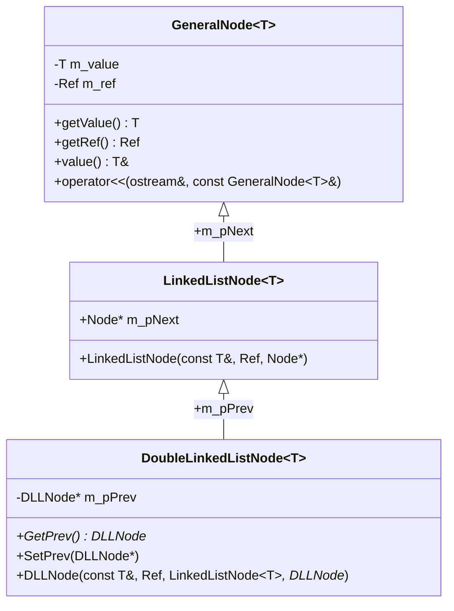
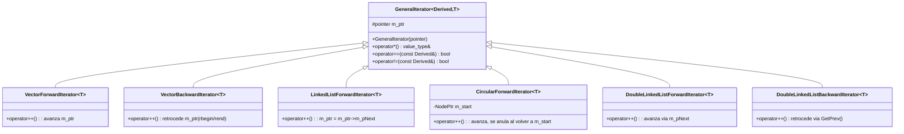
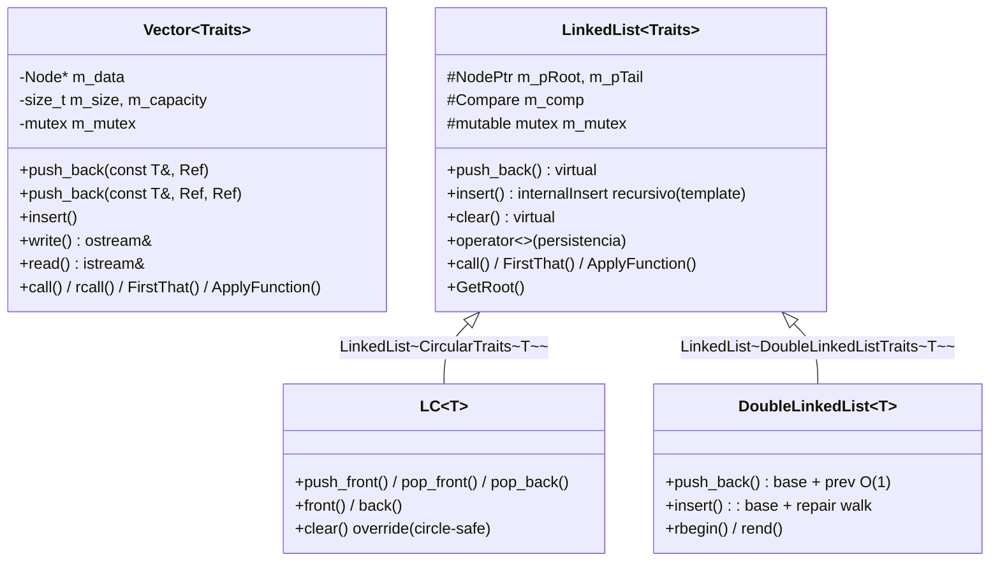
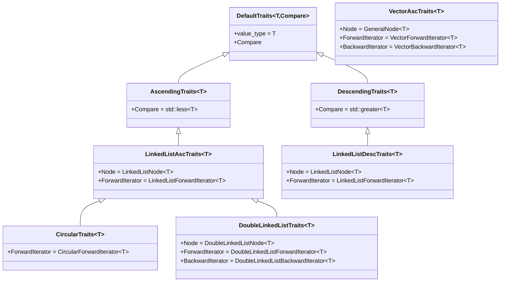
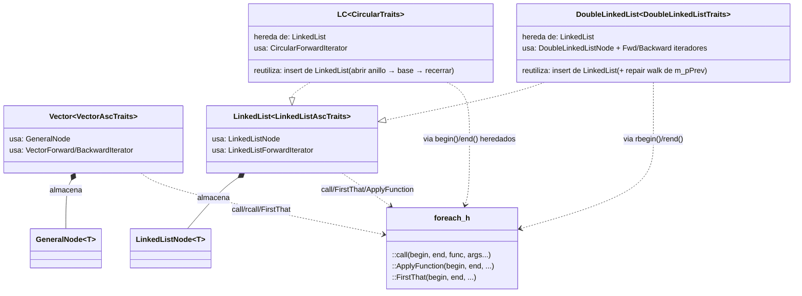

# Jerarquías de clases del curso

> Diagramas de la evolución completa: `Vector` → `LinkedList` → lista circular (`LC`) → lista doblemente enlazada (`DoubleLinkedList`).
> Fuente: `containers/*.h`, `foreach.h`.

## 1 · Nodos

- `GeneralNode`: el par `(value, ref)` — la unidad mínima. `Vector` lo usa **directamente** (`VectorAscTraits::Node = GeneralNode<T>`).
- `LinkedListNode`: agrega el enlace hacia adelante (`m_pNext` público).
- `DoubleLinkedListNode`: agrega el enlace hacia atrás (`m_pPrev` privado con `GetPrev/SetPrev`).

## 2 · Iteradores (CRTP)

- El CRTP (`GeneralIterator<Derived, T>`) comparte `operator*` y los `==/!=` sobre el tipo concreto del hijo — polimorfismo estático, sin vptr (nota 04a).
- Todos exponen el mismo protocolo (`*`, `++`, `!=`) → los algoritmos genéricos de `foreach.h` los consumen sin saber qué contenedor es.
- `CircularForwardIterator` guarda `m_start` y se anula al completar la vuelta: es lo que hace alcanzable el `end()` en un anillo.

## 3 · Contenedores

- `Vector` es la rama independiente (arreglo dinámico con `resize` + `std::exchange` en move).
- `LinkedList` es la base de las enlazadas: nodos encadenados, insert ordenado (recursión de cola con `NodePtrT&`), persistencia y algoritmos heredables.
- `LC` (lista circular): hereda y cierra el anillo — ops de deque (`push_front/pop_*`) en O(1) salvo `pop_back`.
- `DoubleLinkedList`: reutiliza el `insert` de la base y repara los `m_pPrev` con un walk; `rbegin/rend` recorren al revés.

## 4 · Traits

- Los traits son la "tabla de configuración" de cada contenedor: qué `Node` guarda, qué iteradores entrega, cómo ordena (`less/greater`).
- Cambiar el comportamiento del contenedor = otro traits, cero cambios en el contenedor (la lección de la nota 04a: `begin()/end()` devuelven `Traits::ForwardIterator`).
- `VectorAscTraits` vive en `vector.h` (rama de Vector); el resto en `linkedlist.h` / `circularlist.h` / `doublylist.h`.

## 5 · Composición y reuso

- Un solo `::call` genérico (foreach.h) sirve a **todos** los contenedores porque todos entregan pares de iteradores con el mismo protocolo.
- `LC` reutiliza el `insert` de la base abriendo y recerrando el anillo; `DoubleLinkedList` reutiliza el mismo `insert` (templado en `NodePtrT`) y repara los `m_pPrev` con un walk O(n) — la recursión es una sola para las tres listas.
- La persistencia (`operator<<` / `operator>>`) también es heredada: `>>` llama `clear()` y `push_back()` **virtuales**, por eso cada derivada mantiene su invariante (anillo cerrado, prevs correctos) sin duplicar el parser.
